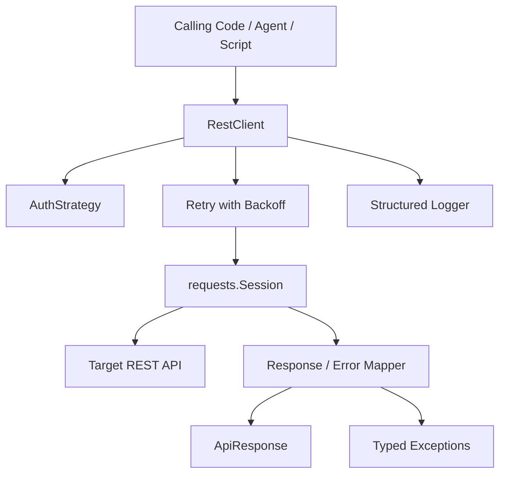
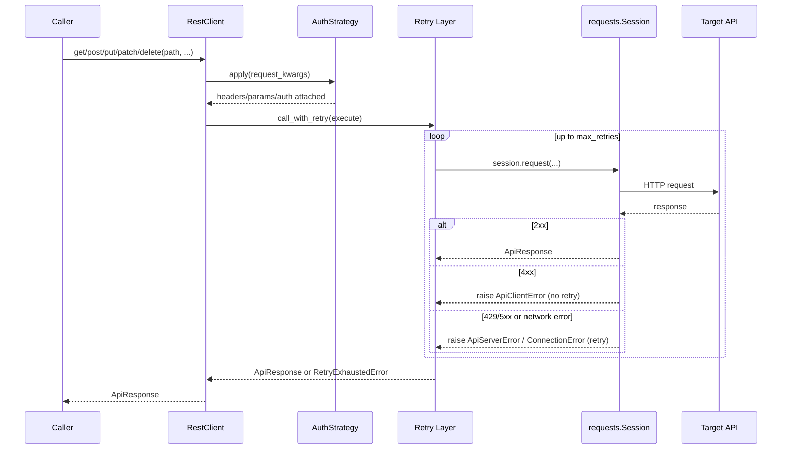

# Universal REST API Automation Engine


A reusable, production-oriented Python client for calling **any REST API** — GET, POST, PUT, PATCH, DELETE — with pluggable authentication, automatic retry with backoff, explicit timeouts, structured logging, and typed error handling.

This is not a wrapper around one specific API. It's the foundational HTTP integration layer other automation projects (CRM sync, agent tool-calling, n8n custom nodes, webhook processors) are built on top of.

## Table of Contents

- [Project Overview](#project-overview)
- [Business Problem](#business-problem)
- [Solution](#solution)
- [Key Features](#key-features)
- [Use Cases](#use-cases)
- [System Architecture](#system-architecture)
- [Tech Stack](#tech-stack)
- [Project Structure](#project-structure)
- [Installation](#installation)
- [Quick Start](#quick-start)
- [Configuration / Environment Variables](#configuration--environment-variables)
- [Authentication Strategies](#authentication-strategies)
- [Error Handling](#error-handling)
- [Testing](#testing)
- [Security](#security)
- [Limitations](#limitations)
- [Future Improvements](#future-improvements)
- [Author](#author)
- [License](#license)

## Project Overview

Nearly every automation project — AI agent tool-calling, CRM sync, n8n custom logic, webhook relays — eventually needs the same thing: a client that reliably talks to a REST API. This engine implements that layer once, correctly, so it can be reused instead of re-implemented (and re-debugged) in every project.

## Business Problem

Ad-hoc `requests.get()` calls scattered through automation scripts tend to share the same problems: no retry on transient failures, no timeout (a hung request can block a whole workflow), inconsistent auth handling, and errors that are swallowed or logged inconsistently. In a business automation context, a single unhandled 503 from a CRM or payment API can silently drop a lead or duplicate a charge.

## Solution

A single, well-tested client class (`RestClient`) that:

- Standardizes how every HTTP call is made, authenticated, retried, and logged
- Fails loudly and specifically (typed exceptions) instead of silently
- Supports idempotency keys so retried writes don't create duplicate side effects
- Is dependency-light (`requests` + the standard library) so it drops into any project

## Key Features

- **Full HTTP verb support**: GET, POST, PUT, PATCH, DELETE
- **Pluggable authentication**: No Auth, API Key (header or query), Bearer Token, Basic Auth, OAuth2 Client Credentials (with automatic token caching + refresh)
- **Automatic retry with exponential backoff + jitter** on connection errors, timeouts, and retryable status codes (429, 500, 502, 503, 504)
- **Explicit connect + read timeouts** on every request — no request can hang forever
- **Structured logging** with a per-request correlation ID (`X-Request-ID`)
- **Typed exception hierarchy** — `ApiClientError` (4xx), `ApiServerError` (5xx), `RequestTimeoutError`, `RetryExhaustedError`, `AuthenticationError`
- **Idempotency key support** for safe retries of non-idempotent writes
- **Environment-variable driven configuration** via `ClientConfig.from_env()`
- **Normalized response object** (`ApiResponse`) — consistent shape regardless of the target API's response format

## Use Cases

- Backbone HTTP layer for AI agent tool-calling (agents calling internal/external APIs)
- Integration layer for n8n/Make custom code nodes that need retry-safe HTTP calls
- CRM / SaaS API sync jobs (HubSpot, GoHighLevel, Notion, Asana, Jira, etc.)
- Webhook relay and outbound notification services
- General-purpose internal SDK base class for project-specific API clients

## System Architecture



**Request flow:**



## Tech Stack

| Category      | Technology                                    |
|---------------|------------------------------------------------|
| Language      | Python 3.10+                                   |
| HTTP          | `requests`                                      |
| Testing       | `pytest`, `pytest-cov`, `unittest.mock`         |
| Linting       | `ruff`                                          |
| Packaging     | `pyproject.toml` (setuptools, src layout)       |
| CI/CD         | GitHub Actions                                  |
| Config        | Environment variables (`.env.example`)          |

## Project Structure

```text
universal-rest-api-engine/
├── README.md
├── LICENSE
├── .gitignore
├── .env.example
├── pyproject.toml
├── requirements.txt
├── pytest.ini
├── docs/
│   ├── architecture.md
│   ├── api.md
│   ├── setup.md
│   ├── security.md
│   └── testing.md
├── src/rest_engine/
│   ├── __init__.py       # public API surface
│   ├── client.py         # RestClient — core request/response logic
│   ├── auth.py           # AuthStrategy implementations
│   ├── config.py         # ClientConfig (dataclass, env-var loader)
│   ├── retry.py          # exponential backoff retry helper
│   ├── exceptions.py     # typed exception hierarchy
│   ├── logger.py         # structured logging setup
│   └── models.py         # ApiResponse
├── tests/
│   ├── unit/              # 17 tests, mocked HTTP layer
│   └── integration/       # tests against a real public API (marked)
├── examples/
│   └── example_usage.py
└── .github/workflows/ci.yml
```

## Installation

```bash
git clone https://github.com/YOUR_GITHUB_URL/universal-rest-api-engine.git
cd universal-rest-api-engine
python -m venv .venv && source .venv/bin/activate
pip install -e ".[dev]"
```

## Quick Start

```python
from rest_engine import RestClient, ClientConfig, BearerTokenAuth

config = ClientConfig(base_url="https://api.example.com", max_retries=3)
client = RestClient(config=config, auth=BearerTokenAuth(token="your-token"))

response = client.get("/users", params={"page": 1})
print(response.status_code, response.json_body)

response = client.post("/users", json={"name": "Ada Lovelace"})
```

See [`examples/example_usage.py`](examples/example_usage.py) for a full GET/POST/PUT/PATCH/DELETE + error-handling walkthrough.

## Configuration / Environment Variables

`ClientConfig` can be built explicitly in code or loaded from environment variables via `ClientConfig.from_env()`. See [`.env.example`](.env.example) for the full list. Never commit a real `.env` file — it's excluded via `.gitignore`.

| Variable | Required | Default | Purpose |
|---|---|---|---|
| `REST_ENGINE_BASE_URL` | Yes | — | Base URL of the target API |
| `REST_ENGINE_TIMEOUT_SECONDS` | No | `15` | Read timeout per request |
| `REST_ENGINE_MAX_RETRIES` | No | `3` | Retry attempts after the first |
| `REST_ENGINE_BACKOFF_FACTOR` | No | `0.5` | Exponential backoff base |
| `REST_ENGINE_VERIFY_SSL` | No | `true` | Disable only for local/dev testing |

Auth credentials (`API_KEY`, `BEARER_TOKEN`, `OAUTH2_CLIENT_ID`, etc.) are passed explicitly into the relevant `AuthStrategy` — they are read by *your* application code, not by this library, so you control exactly where secrets come from (env vars, a secrets manager, etc.).

## Authentication Strategies

| Strategy | Use case |
|---|---|
| `NoAuth` | Public APIs |
| `ApiKeyAuth` | Header or query-param API keys |
| `BearerTokenAuth` | `Authorization: Bearer <token>` |
| `BasicAuth` | Username/password APIs |
| `OAuth2ClientCredentials` | OAuth2 client-credentials grant, with in-memory token caching and automatic refresh before expiry |

## Error Handling

| Exception | Trigger | Retried automatically? |
|---|---|---|
| `ApiClientError` | 4xx response | No — these indicate a bad request and won't succeed on retry |
| `ApiServerError` | 5xx response | Yes |
| `RequestTimeoutError` | Request exceeded timeout | Underlying connection errors are retried; a final timeout surfaces this |
| `RetryExhaustedError` | All retry attempts failed | N/A — terminal |
| `AuthenticationError` | Auth strategy misconfigured or OAuth2 token fetch failed | No |

Retries use exponential backoff with jitter (`backoff_factor * 2^attempt + random jitter`) to avoid thundering-herd retries against a struggling API.

## Testing

```bash
# Unit tests (mocked HTTP layer, no network required)
pytest tests/unit -m "not integration" --cov=rest_engine --cov-report=term-missing

# Integration tests (hits a real public test API — requires network)
pytest tests/integration -m integration
```

Current status: **17/17 unit tests passing, 78% line coverage** (verified locally; see [`docs/testing.md`](docs/testing.md) for the coverage breakdown).

## Security

- No secrets are hardcoded or logged. Auth tokens are held in memory only.
- `.env` is git-ignored; `.env.example` documents required variables without values.
- SSL verification is on by default (`verify_ssl=True`); disabling it is opt-in and should be dev-only.
- Every request carries a unique `X-Request-ID` for correlation in logs — no request bodies containing credentials are logged.
- 4xx responses are never retried, avoiding repeated failed-auth hammering of an API.
- See [`docs/security.md`](docs/security.md) for the full threat-consideration checklist.

## Limitations

- No async/`httpx` variant yet — this is a synchronous client.
- OAuth2 support currently covers the client-credentials grant only (no authorization-code/PKCE flow).
- No built-in circuit breaker (a persistently-failing downstream API will still be retried per-request up to `max_retries`, though it fails fast on the next request).
- No response caching layer.

## Future Improvements

- Async client variant (`httpx`-based) for high-concurrency use cases
- Pagination helpers (cursor-based and offset-based auto-pagination)
- Circuit breaker to short-circuit calls to a known-down API
- OpenAPI-spec-driven client generation mode
- Pluggable response caching (Redis-backed) for idempotent GETs

## Author

**Sohag Gain**
AI Automation Engineer | AI Agent Engineer | AI Solutions Builder | Entrepreneur

Website: https://sohaggain.com
GitHub: YOUR_GITHUB_URL
LinkedIn: YOUR_LINKEDIN_URL

## License

MIT — see [LICENSE](LICENSE).
